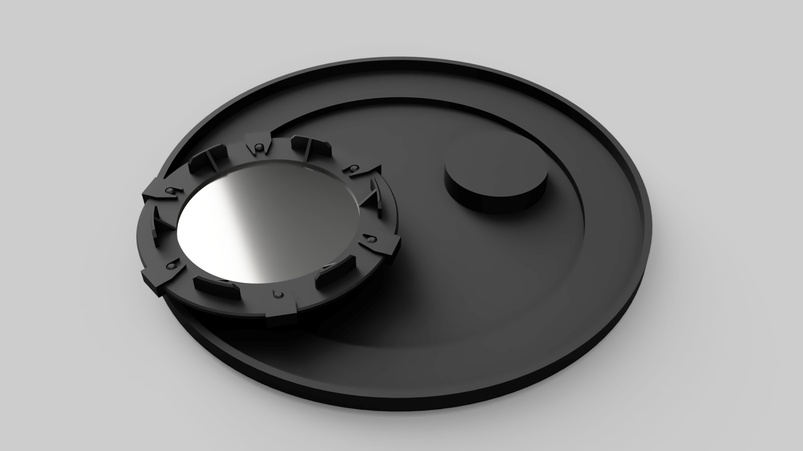

# sunfilter 

An utterly overengineered 3D printable holder for sun filters for telescopes.

## Disclaimer

I do not take any responsibility for any injuries that come of using this project.

Only ever use *proper* sun filters that filter out at leas 99.999 % of the light.

Before *every* use, check the filter for signs of stretching, holes or other forms of damage.

Do not rely on your 3D printer to produce a light-tight print.
Additionally you should cover the print in something like aluminum tape.
Aluminum tape is *NO* proper sun filter, do not use it as such.

## Maturity of this Project

**As of now, I have not printed a single piece, so it might not work at all.**

I will update this note as soon as I have printed parts.

## Reusability of this Project

I designed this holder to maximise the size of the filter for off center mounting on my 254/1200 mm Dobson with a 58 mm diameter secondary mirror.
You probably have to tweak the sizes for it to fit perfectly on your telescope.
This is no problem though, if you use Fusion360.
I tried my best to make this design nice and parametric.

Also you probably have to design your own CoverAdapter.
Just look at the Fusion360 file and you'll be easily able to figure out the needed dimensions on the filter holder side.

## The Components

- **FilterHolderOuter**: Half of the holder, facing the sun.
- **FilterHolderInner**: Half of the holder, facing the telescope.
- **Bolts**: Hold the filter in place
- **Clips**: Hold the two halves of the holder together (with the filter in between)
- **OuterCap**: Goes over the holder half, that faces the sun.
- **InnerCap**: Goes over the holder half, that faces the telescope, when the filter is not attached.
- **CoverAdapter**: Gets glued on to the standard telescope cap to make it compatible with the filter holder.
- **CoverAdapterCap**: Goes over the CoverAdapter when the holder is not attached.

# License

 This work by <a xmlns:cc="http://creativecommons.org/ns#" href="https://github.com/targodan" property="cc:attributionName" rel="cc:attributionURL">targodan</a> is licensed under a <a rel="license" href="http://creativecommons.org/licenses/by-nc-sa/4.0/">Creative Commons Attribution-NonCommercial-ShareAlike 4.0 International License</a>. Based on a work at <a xmlns:dct="http://purl.org/dc/terms/" href="https://github.com/targodan/sunfilter" rel="dct:source">https://github.com/targodan/sunfilter</a>.
